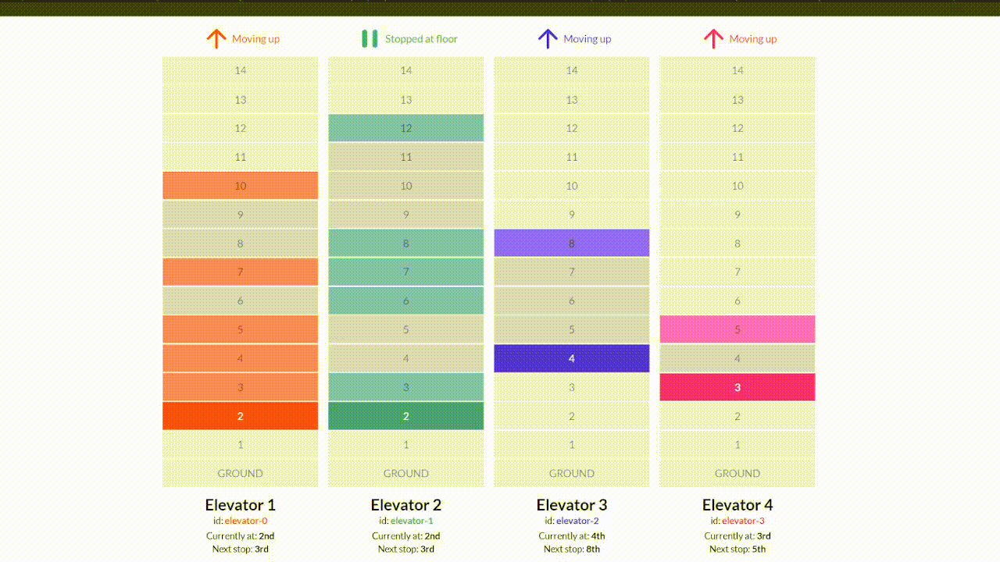
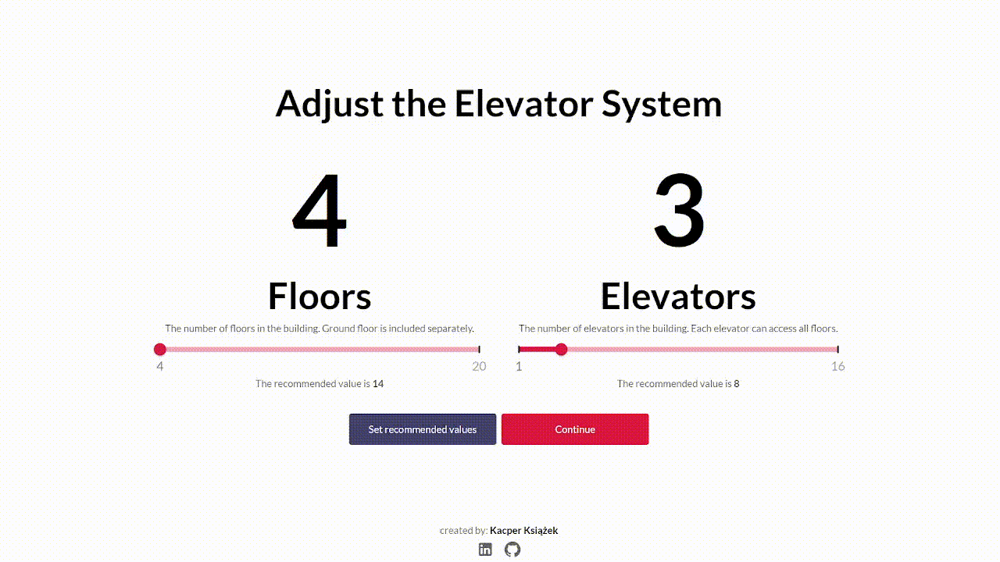
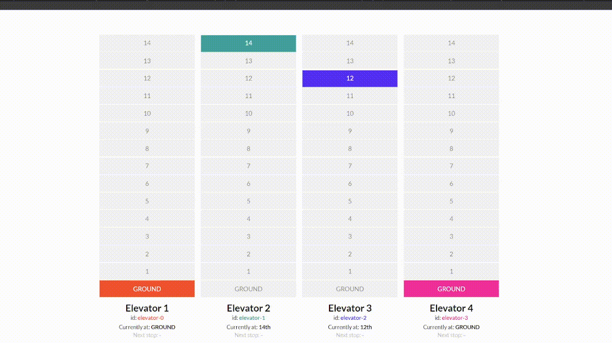
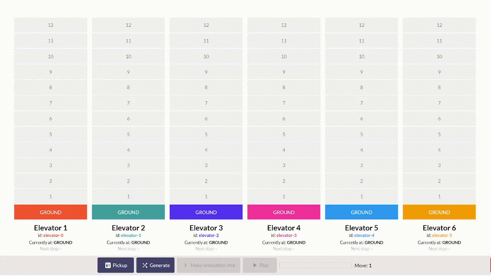
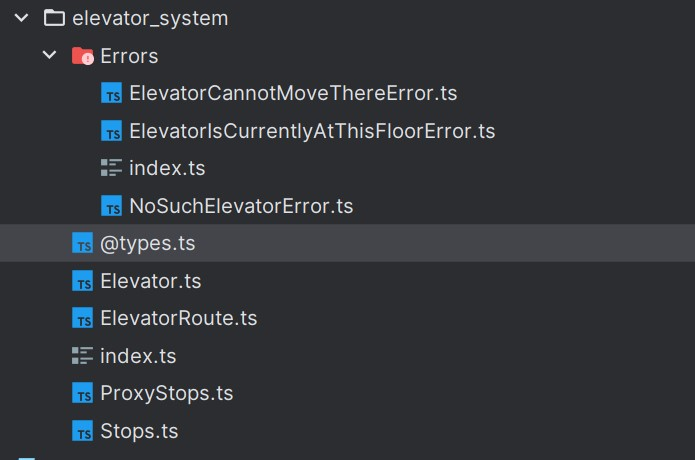

# Elevator System

By Kacper Książek

🌍 [Live demo](https://elevators-one.vercel.app/)

---

## 🛠️ Tech stack

- **IDE**: WebStorm _(I wanted to use something different than VSCode, which is my primary IDE when it comes to frontend
  development)_
- TypeScript
- Jest
- React
- Material UI
- Vite
- Vercel
- Vim
- Figma
- GitHub Copilot

---

# 🚦How to run the project

1. Clone the repository
2. Install dependencies, for example using `npm i`
3. Run the project using `npm run dev`. Local server should be running on http://localhost:5173/
4. Run tests using `npm run test`

---

# 🗺️ Overview

I divided this project into 3 main parts:

### 📋 1 MVP (⏱️30% of total time)

In this part, my main objective was to create a simple, working version of the app ( **MVP** ). I aimed to ensure that
the app is
functional and meets the requirements. Most of the time was spent on designing the general architecture of the app.
During this phase, my only interaction with the app was through unit tests.

**🛠️ Stack**: 1. TypeScript, 2. Jest

**🗓️ Calendar**: Monday 8th - Wednesday 10th

---

### 🧪 2 Tests and Problem-Solving (⏱️25% of total time)

In this part, I focused on writing tests for the MVP and solving any problems that arose. I wanted to ensure the app's
stability and that it works as expected. Additionally, I aimed to make the app easy to maintain and extend in the
future. This phase covered every edge case related to single elevator movement.

**🛠️ Technologies**: 1. TypeScript, 2. Jest

**🗓️ Calendar**: Wednesday 10th - Thursday 11th

---

### 🎨 3 UI and UX (⏱️ remaining 45% of total time)

The goal here was straightforward: showcase my final product. I didn't want to waste the potential of my elevator logic,
so I spent a significant amount of time creating an appealing and visually pleasing interface to interact with my
elevator system.

**🛠️ Technologies**: 1. React, 2. Material UI, 3. Vite, 4. Vercel, 5. Figma

**🗓️ Calendar**: Friday 12th - Monday 15th


---

# 🎭 UI Features Preview

## 1. Customize your elevator system

You can choose the number of both floors and elevators in the building.

⚠️ **Warning**: There IS NO RWD implemented, so the app may look weird on smaller screens, so be careful with the number
of floors and elevators you choose.



## 2. Request an elevator

Probably the most important feature of the app. You can request an elevator to pick you up from a specific floor and
take you to another one and see how the system handles it.



## 3. Random routes generator

Adding all these routes manually would be a nightmare, so I implemented a random routes generator. The number of routes
is constant and scales with the number of elevators in the building. The number always equals the number of elevators.

```typescript
const N: number = 20; // number of floors in the building
const numberOfElevators: number = Math.round(N / 3);
```



---

# 🚀 How does it work

The entire system logic is inside the `src/tools/elevator_system` directory. The main file `index.ts` contains
the `ElevatorSystem` class, which is responsible for managing the elevators.

The content of the aforementioned directory:



### 🤖 Interfaces: ElevatorSystem

My final version of the `ElevatorSystem` class significantly differs from the implementation suggested in the assignment
description. I decided to create a more complex system that can handle elevators traffic in a more efficient way. I
discarded the idea of **FCFS** (First-Come-First-Served) and implemented a more advanced algorithm that takes into
account the direction of the elevator and the direction of the request.

My `ElevatorSystem` class has the following methods:

```typescript
interface ElevatorSystem {
    /** The ultimate floor number in the building */
    maxFloor: number;

    /** The number of elevators in the building */
    elevatorsAmount: number;

    /** Whether the simulation can proceed meaning there is an elevator that can move */
    simulationCanProceed: boolean;

    /** The current status of all elevators */
    status: ElevatorState[];

    /** Request an elevator to pick up a person */
    requestElevator(request: ElevatorRequest): void;

    /** Simulate a step of the elevator system */
    doSimulationStep(): void;
}
```

and the constructor of the class takes 2 arguments. Here's an example of how to create an instance of
the `ElevatorSystem` class:

```typescript
const elevatorSystem = new ElevatorSystem({
    maxFloor: 10,
    elevatorsAmount: 3
});
```

Instead of making the array of `Elevator` objects public, I decided to summarize the status of all elevators in the
`status` field. The `status` is a public getter that returns an `ElevatorState` object.

```typescript
/** The ID of an elevator */
export type ElevatorID = `elevator-${number}`;

/** The direction of elevator movement */
export type ElevatorMoveDirection = "UP" | "DOWN";

/** The status of an elevator */
export type ElevatorStatus = `MOVING_${ElevatorMoveDirection}` | "STOPPED_AT_FLOOR" | "IDLE";

/** Interface describing the state of an elevator */
export interface ElevatorState {
    elevatorID: ElevatorID;

    /** The current floor the elevator is on */
    currentFloor: number;

    /** The status of the elevator */
    status: ElevatorStatus;

    /** The floors the elevator will stop at next */
    nextStops: number[] | null;

    /** In the form of "#RRGGBB" */
    color: `#${string}`;
}
```

### 🤖 Interfaces: Elevator

Class representing a single elevator. `ElevatorSystem` contains an array of `Elevator` objects as a private field and
the entire logic of the system is based on them.

```typescript
interface Elevator {
    /** All routes the elevator has to take in order */
    routes: ElevatorRoute[];

    /** All floors that are connected by proxies */
    proxies: ProxyStops;

    /** The current status of the elevator */
    status: ElevatorStatus;

    /** The current floor the elevator is on */
    currentFloor: number;

    /** Request the elevator to pick up a person from and to specific floors */
    pickup(startFloor: number, destinationFloor: number): void;

    /** Request the elevator to pick up a person from the current floor to a specific floor */
    pickupFromCurrentFloor(destinationFloor: number | number []): void;

    /** Perform a simulation step of the elevator system */
    makeSimulationMove(): void;
}
```

### 🪚 Utilities: Stops

The `Stops` class is extending the `Array` class and basically all it does is pushing new stops while keeping the order
of elements in the array either `ascending` or `descending`.

The purpose of this class is to represent all subsequent stops that the elevator has to make in order to complete the
route. The order of stops (`ASC` or `DESC`) is determined the direction in which the elevator is moving (`UP`
or `DOWN`).

```typescript
class Stops extends Array<number> {
    // ...
    public insertWithOrder(value: number, order: "ASC" | "DESC"): void {
        if (order === "ASC") {
            this.insertInAscendingOrder(value);
        } else {
            this.insertInDescendingOrder(value);
        }
    }

    // ...
}
```

### 🪚 Utilities: ProxyStops

Class creating a Map where floors are keys and values are arrays of floors to which the elevator can go only after
reaching the key floor.

**Problem**:
Elevator is currently at 3rd floor and is requested from 10th to go to 4th. Without proxy stops, the elevator would go
firstly to 4th and then to 10th, because 4th is closer and obviously this is exactly how a real elevator would have
never behaved.

**Solution**: Introducing proxy mechanism allows limiting an elevator to go to the certain floors only after reaching
other floor first.

```typescript
class ProxyStops {
    private proxy = new Map<number, number[]>();

    /** Add a proxy for a given stop */
    public addProxyForStop(proxy: number, connectedFloor: number | number[]): void {
        // ...
    }

    /** Accept a floor number and return all proxies connected to it */
    public getConnectedFloors(proxy: number, removeItAfterwards: boolean = true): number[] {
        // ... 
    }
}
```

### 🤖 Interfaces: ElevatorRoute

Gather floors that the elevator is going to visit in order. The route is always one-directional, meaning that the
elevator can move either `up` or `down` within a single route.

```typescript
export interface ElevatorRoute {
    /** The array of floors the elevator is going to stop at in order */
    stops: Stops;

    /** The direction in which the elevator is moving during this route */
    direction: ElevatorMoveDirection;

    /** Returns boolean value if the elevator can fit in the route*/
    canFit(floor: number): boolean;

    /** Add a new stop to the route */
    addStop(floor: number): void;
}


```

## 🛠️ Algorithm

I've based my algorithm on the mechanism of so-called **elevator routes**, which describe horizontal paths that an
elevator takes while moving between floors. These routes are one-directional, meaning an elevator can move either `up`
or `down` within a single route, and they are implemented by the `ElevatorRoute` class. Each route contains all the
floors, referred to as "Steps," that the elevator is going to visit.

Every `Elevator` object maintains a list of `ElevatorRoute` objects. The primary concept is to avoid creating new routes
for every request and instead reuse existing ones. This strategy enhances efficiency and minimizes unnecessary movements
between floors.

New stops are added using the public `.pickup()` method, an instance method of the `Elevator` class. This method
facilitates the addition of new destinations to the elevator's route.

```ts
function pickup(startFloor: number, destinationFloor: number): void {
    // ...
};
```

When this method is called, the algorithm adds only one new stop - the `startFloor`, while attempting to incorporate it
into the existing route rather than creating a new one. If the `startFloor` cannot be added to any existing route, a new
route is created. On top of that, the `startFloor` becomes a `ProxyStop` object, responsible for storing all floors the
elevator will visit after reaching it. The `destinationFloor` is automatically set as a stop to reach after
the `startFloor` is reached.

#### The procedure for adding any new stop (either `startFloor` or `destinationFloor`) is as follows:

1. Check if the `floor` can fit into any existing route, provided that the elevator is moving in the same direction as
   the request and the `floor` is on the way (not behind the elevator).
2. If the `floor` cannot be added to any existing route, create a new route for it.
3. Add the `floor` to the route.

---

# ✨ Ideas for future improvements

1. **Elevator music** - Can you imagine a world without elevator music? Me neither, so I would love to add some relaxing
   tunes to the app.